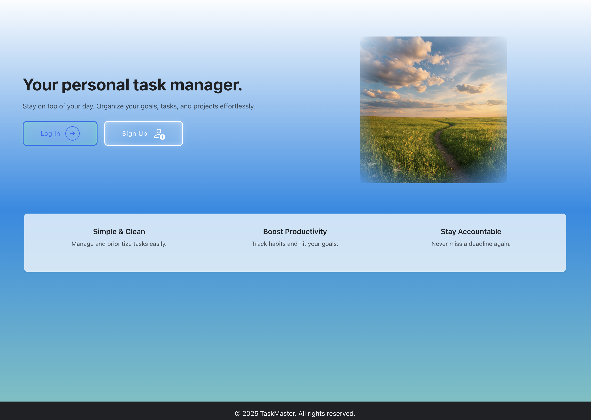
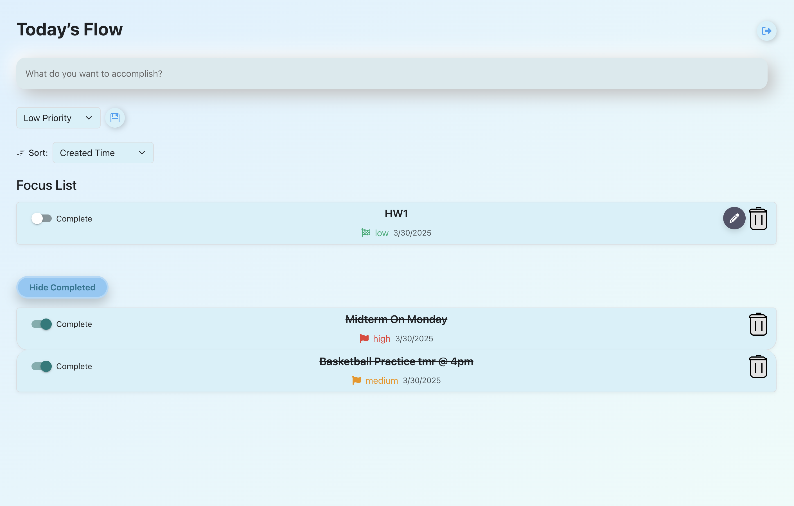
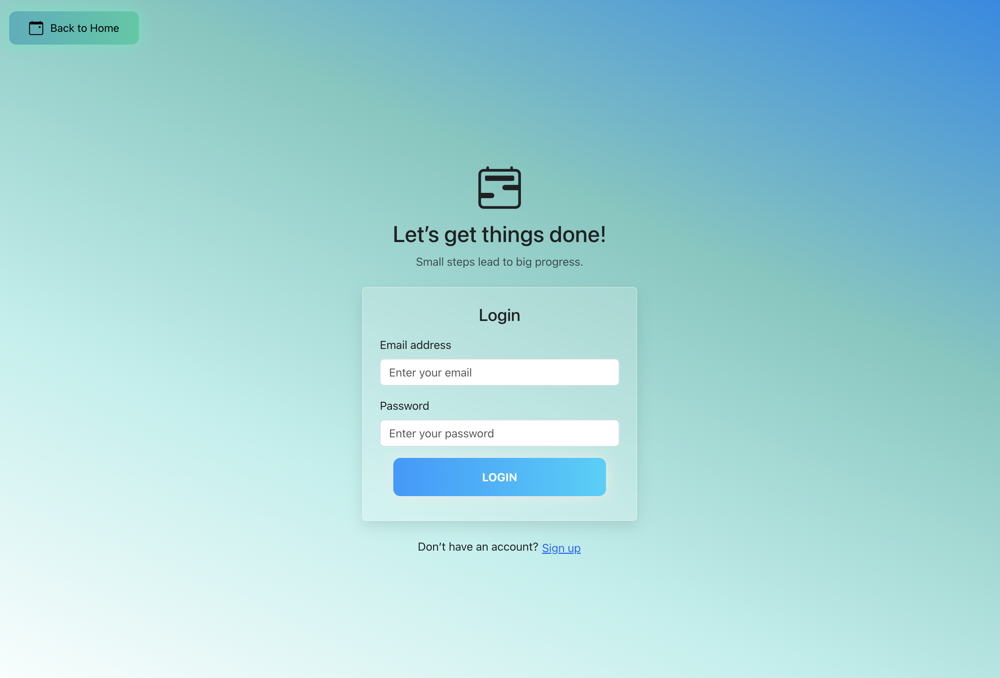

# 📝 Full-Stack TODO App

A minimalist and responsive full-stack To-Do list application built with **React** (frontend) and **Node.js/Express** (backend), with **MongoDB** for data storage. Designed for calm productivity with JWT-based authentication.

## 🌟 Features

- User registration and login (JWT Auth)
- Create, edit, and delete tasks
- Mark tasks as completed
- Sort and filter tasks
- Custom dropdowns and minimalist design
- Responsive layout

## 🏗️ Project Structure
```
TODO_APP/
├── backend/               # Express server, API routes, MongoDB 
│   ├── models/            # Mongoose models (e.g., User, Task)
│   ├── routes/            # API routes (e.g., auth, tasks)
│   ├── middleware/        # Auth middleware, error handling
│   ├── .env               # Environment variables
│   └── server.js          # Entry point for backend server
│
├── frontend/              # React app with pages and components
│   ├── src/
│   │   ├── pages/         # Pages like LoginPage, RegisterPage, TasksPage
│   │   ├── context/       # Auth context for global state
│   │   └── App.js         # Main React component
│   └── package.json       # Frontend dependencies and scripts
│
└── README.md              # Project documentation

```

## 📸 Screenshots

###  Home Page


### ✅ Tasks Page


### 🔒 Login Page



## 🚀 Getting Started Locally

### 1. Clone the Repository
```bash
git clone https://github.com/759257989/todolist_application.git
cd todolist_application
```
### 2. Set Up the Backend
```
cd backend
npm install
```
### 3. Backend Environment Variables
- Create a .env file inside backend directory with the following content of your actual secrets and database connection strings:
```
PORT=5001
MONGO_URI=your_mongodb_connection_string
JWT_SECRET=your_jwt_secret
```
### 4. Start the Backend Server
- In backend directory and run:
```
npm run dev
```
- The server will run at http://localhost:5001

### 5. Set Up the Frontend 
- In a seperate terminal, navigate to frontend directory and run
```
cd ../frontend
npm install
```
- To install the dependecies

### 6. Start Frontend
- To start the React App run
```
npm start
```
- The app will run at http://localhost:3000


## 🛠️ Built With
- React

- Node.js

- Express

- MongoDB

- JWT
- Bootstrap for frontend styling
